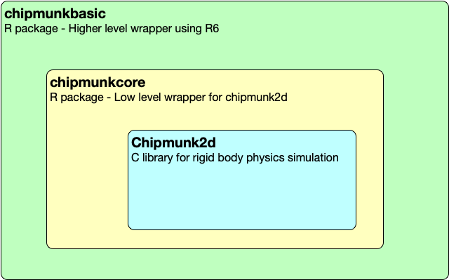

<!-- README.md is generated from README.Rmd. Please edit that file -->

```{r, include = FALSE}
knitr::opts_chunk$set(
  collapse = TRUE,
  comment = "#>",
  fig.path = "man/figures/README-",
  out.width = "100%"
)

if (FALSE) {
  pkgdown::build_site(override = list(destination = "../coolbutuseless.github.io/package/chipmunkcore"))
}

library(chipmunkcore)
```

# chipmunkcore

<!-- badges: start -->

[](https://www.tidyverse.org/lifecycle/#experimental)
<!-- badges: end -->

`chipmunkcore` is a low-level wrapper around the [Chipmunk2d](http://chipmunk-physics.net/) rigid body 
physics simulation library.


`chipmunkcore` is just the simulator. To actually render the positions of bodies in the simulation you'll need
to use [ggplot2](https://cran.r-project.org/package=ggplot2), [cairocore](https://github.com/coolbutuseless/cairocore) or
something else


**Read the online documentation for `chipmunkcore` [here](https://coolbutuseless.github.io/package/chipmunkcore)**

**Regular users will probably want to use the higher level wrapper [`chipmunkbasic`](https://coolbutuseless.github.io/package/chipmunkbasic)**


## Chipmunk2d

* [Chipmunk2d](http://chipmunk-physics.net/) is a C library for simulating rigid
body physics
* [chipmunkcore](https://coolbutuseless.github.io/package/chipmunkcore) is a very low-level
wrapper around the C library, providing 1-to-1 mapping between R functions and 
the core C library
* [chipmunkbasic](https://coolbutuseless.github.io/package/chipmunkbasic) provides a 
nicer wrapper around `chipmunkcore`




## System Pre-requisites - chipmunk2d C library

You'll need to install the [Chipmunk2d](http://chipmunk-physics.net/) library on 
your system.


<details>
<summary> Click to show instructions for macOS </summary>
I only know how to do this on macOS where you can do

```
brew install chipmunk
```

You may also need to update/install your xcode tools - see [here](https://stackoverflow.com/questions/58313047/cannot-compile-r-packages-with-c-code-after-updating-to-macos-catalina)

</details>


<details>
<summary> Click to show instructions for ubuntu - method 1 </summary>

Thanks to [tylermorganwall](https://twitter.com/tylermorganwall) for the following instructions

I spun up an RStudio AMI on AWS to try and install chipmunkcore and was successful. Here's my instructions:

First we need to install cmake if it's not already installed, along with some other pre-reqs:
```sh

sudo apt install cmake
sudo apt-get install xorg-dev

```

Now we install the Chipmunk2D library:
```sh
git clone https://github.com/slembcke/Chipmunk2D
cd Chipmunk2D
cmake .
make
```
And finally, symlink the header files and shared object library so R can find it during installation. The path `/home/rstudio/Chipmunk2D` will be different depending on where you installed the Chipmunk2D folder.

```sh
sudo ln -s /home/rstudio/Chipmunk2D/include/chipmunk /usr/share/R/include/chipmunk
sudo ln -s /home/rstudio/Chipmunk2D/src/libchipmunk.so /usr/lib/R/lib/libchipmunk.so
```

</details>


<details>
<summary> Click to show instructions for Linux (verified on Ubuntu 18.04 LTS) - Method 2 </summary>


Thanks to [Henrik Bengtsson](https://twitter.com/henrikbengtsson) for the following instructions.

These instructions should work on most Linux systems.

Following the instructions on <https://github.com/slembcke/Chipmunk2D>:

Before we can _install_ the software, we need to _build_ it:

```sh
curl -L -O https://github.com/slembcke/Chipmunk2D/archive/Chipmunk-7.0.3.tar.gz
tar xf Chipmunk-7.0.3.tar.gz
cd Chipmunk2D-Chipmunk-7.0.3
cmake .
make
```

Now we can _install_ it.  **If we have admin rights**, we can install it system-wide as:

```sh
sudo make install
```

You're done!


**If we only have non-privileged user rights** on the system, then `sudo make install` will give an error.  Instead, we have to install to a folder where we have write permissions.  This can be done by specifying the CMake-specific environment variable `DESTDIR`:

```sh
mkdir -p "$HOME/software/Chipmunk-7.0.3"
make DESTDIR="$HOME/software/Chipmunk-7.0.3" install
```

For other software to be able to compile toward Chipmunk2D, we need to update a few standard environment variable:

```sh
export CPATH="$HOME/software/Chipmunk-7.0.3/usr/local/include:${CPATH}"
export LIBRARY_PATH="$HOME/software/Chipmunk-7.0.3/usr/local/lib:${LIBRARY_PATH}"
```
If you got this far, you should be able to _install_ [**chipmunkcore**](https://github.com/coolbutuseless/chipmunkcore) in R:

```r
# install.package('remotes')
remotes::install_github('coolbutuseless/chipmunkcore')
```

Now, in order for compiled software to find the Chipmunk2D library files when running, we also need to add:
```sh
export LD_LIBRARY_PATH="$HOME/software/Chipmunk-7.0.3/usr/local/lib:${LD_LIBRARY_PATH}"
```

If you got, you will be able to use the [**chipmunkcore**](https://github.com/coolbutuseless/chipmunkcore) package:

```r
> library(chipmunkcore)
>
```

If you get:
```
> library(chipmunkcore)
Error: package or namespace load failed for 'chipmunkcore' in dyn.load(file, DLLpath = DLLpath, ...):
 unable to load shared object '/home/alice/R/x86_64-pc-linux-gnu-library/4.0-custom/chipmunkcore/libs/chipmunkcore.so':
libchipmunk.so.7: cannot open shared object file: No such file or directory
```
then `LD_LIBRARY_PATH` is either not set or set incorrect.


_Tips_: Append the above `export ...` lines to your `~/.bashrc` so set them automatically.


</details>


<details>
<summary> No windows instructions available for C library installation - Can you help?</summary>

If you know how to install the [Chipmunk2d C library](http://chipmunk-physics.net/) on Windows, and subsequently compile
this package, please let me know by filing an issue, or pinging me on 
[twitter](https://twitter.com/coolbutuseless). Thanks!

</details>

    
## Installation

After installing the [Chipmunk2d](http://chipmunk-physics.net/) C library, 
you can install this package from [GitHub](https://github.com/coolbutuseless/chipmunkcore) with:

``` r
# install.package('remotes')
remotes::install_github('coolbutuseless/chipmunkcore')
```


## Vignettes

* [Advanced - lower level functions](https://coolbutuseless.github.io/package/chipmunkcore/articles/advanced.html)

## ToDo

* Add *constraints*
* Expose more of the underlying C library

## Bespoke Functions

The chipmunk C library is very low level, and it's not always convenient/quick in R
to loop over a set of structures to accumulate a result.

For these reasons, there are some bespoke functions which take some of the drudgery
out of calling into C

* `get_body_state(bodies)` will return a data.frame of all current state information
for the bodies listed i.e. position, velocity, force, angle, angular velocity and torque.

## Example: Galton Board

For full code, see the [vignette](https://coolbutuseless.github.io/package/chipmunkcore/articles/galton.html)
in [chipmunkbasic](https://github.com/coolbutuseless/chipmunkbasic) 


## Acknowledgements

* R Core for developing and maintaining the language.
* CRAN maintainers, for patiently shepherding packages onto CRAN and maintaining
  the repository
