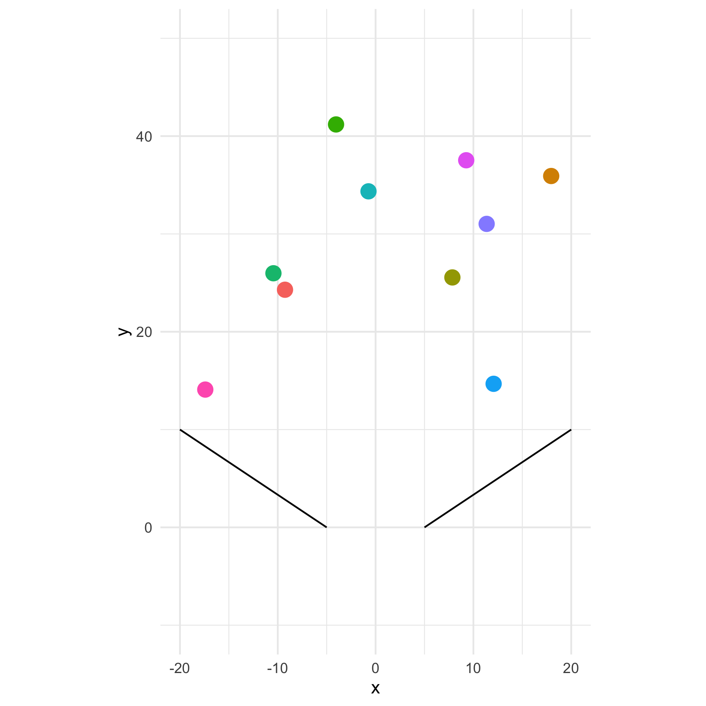

<!-- README.md is generated from README.Rmd. Please edit that file -->

# chipmunkcore

<!-- badges: start -->


<!-- badges: end -->

`chipmunkcore` is a low-level wrapper around the
[Chipmunk2d](http://chipmunk-physics.net/) rigid body physics simulation
library.

There are many low-level functions available, but currently it’s
probably best to use the limited functionality available through the
simple [R6]() class provided - `ChipmunkBasic`

`chipmunkcore` is just the simulator. To render the positions of bodies
in the simulation you’ll need to use
[ggplot2](https://cran.r-project.org/package=ggplot2),
[cairocore](https://github.com/coolbutuseless/cairocore) or something
else

**Read the online documentation
[here](https://coolbutuseless.github.io/package/chipmunkcore)**

## Pre-requisites

You’ll need to install the [Chipmunk2d](http://chipmunk-physics.net/)
library on your system.

I only know how to do this on macOS where you can do

    brew install chipmunk

If you know how to install this library on other systems, and
subsequently compile this package, please let me know by filing an
issue, or pinging me on [twitter](https://twitter.com/coolbutuseless)

## Installation

After installing the [Chipmunk2d](http://chipmunk-physics.net/) C
library, you can install this package from
[GitHub](https://github.com/coolbutuseless/chipmunkcore) with:

``` r
# install.package('remotes')
remotes::install_github('coolbutuseless/chipmunkcore')
```

## ToDo

  - Add other shapes besides circles
  - Add *constraints*
  - Expose more of the underlying C library

## Galton Board

For full code, see the
[vignette](https://coolbutuseless.github.io/package/chipmunkcore/articles/galton.html)


## A simple simulation

``` r
library(chipmunkcore)
library(ggplot2)
set.seed(1)

#~~~~~~~~~~~~~~~~~~~~~~~~~~~~~~~~~~~~~~~~~~~~~~~~~~~~~~~~~~~~~~~~~~~~~~~~~~~~~
# Initialize a simulation space
#~~~~~~~~~~~~~~~~~~~~~~~~~~~~~~~~~~~~~~~~~~~~~~~~~~~~~~~~~~~~~~~~~~~~~~~~~~~~~
cm <- Chipmunk$new()

#~~~~~~~~~~~~~~~~~~~~~~~~~~~~~~~~~~~~~~~~~~~~~~~~~~~~~~~~~~~~~~~~~~~~~~~~~~~~~
# Add fixed segments
#~~~~~~~~~~~~~~~~~~~~~~~~~~~~~~~~~~~~~~~~~~~~~~~~~~~~~~~~~~~~~~~~~~~~~~~~~~~~~
cm$add_segment(-20, 10, -5, 0)
cm$add_segment( 20, 10,  5, 0)

#~~~~~~~~~~~~~~~~~~~~~~~~~~~~~~~~~~~~~~~~~~~~~~~~~~~~~~~~~~~~~~~~~~~~~~~~~~~~~
# Fetch all the segments. Use for plotting
#~~~~~~~~~~~~~~~~~~~~~~~~~~~~~~~~~~~~~~~~~~~~~~~~~~~~~~~~~~~~~~~~~~~~~~~~~~~~~
segments_df <- cm$get_segments()

#~~~~~~~~~~~~~~~~~~~~~~~~~~~~~~~~~~~~~~~~~~~~~~~~~~~~~~~~~~~~~~~~~~~~~~~~~~~~~
# Add some bodies. Currently only circular bodies supported
#~~~~~~~~~~~~~~~~~~~~~~~~~~~~~~~~~~~~~~~~~~~~~~~~~~~~~~~~~~~~~~~~~~~~~~~~~~~~~
for (i in 1:10) {
  cm$add_body(
    x = runif(1, -20, 20), 
    y = runif(1,  10, 50),
    vx = 10 * rnorm(1),
    vy = 10 * rnorm(1)
  )
}

#~~~~~~~~~~~~~~~~~~~~~~~~~~~~~~~~~~~~~~~~~~~~~~~~~~~~~~~~~~~~~~~~~~~~~~~~~~~~~
# Get the current positions of the bodies. as a data.frame
#~~~~~~~~~~~~~~~~~~~~~~~~~~~~~~~~~~~~~~~~~~~~~~~~~~~~~~~~~~~~~~~~~~~~~~~~~~~~~
bodies <- cm$get_bodies()
bodies


for (frame in 1:45) {
  #~~~~~~~~~~~~~~~~~~~~~~~~~~~~~~~~~~~~~~~~~~~~~~~~~~~~~~~~~~~~~~~~~~~~~~~~~~~
  # Advance the simulation
  #~~~~~~~~~~~~~~~~~~~~~~~~~~~~~~~~~~~~~~~~~~~~~~~~~~~~~~~~~~~~~~~~~~~~~~~~~~~
  cm$advance(5)
  
  #~~~~~~~~~~~~~~~~~~~~~~~~~~~~~~~~~~~~~~~~~~~~~~~~~~~~~~~~~~~~~~~~~~~~~~~~~~~
  # Get the bodies in their new locations
  #~~~~~~~~~~~~~~~~~~~~~~~~~~~~~~~~~~~~~~~~~~~~~~~~~~~~~~~~~~~~~~~~~~~~~~~~~~~
  bodies <- cm$get_bodies()
  
  #~~~~~~~~~~~~~~~~~~~~~~~~~~~~~~~~~~~~~~~~~~~~~~~~~~~~~~~~~~~~~~~~~~~~~~~~~~~~~
  # Plot everything
  #~~~~~~~~~~~~~~~~~~~~~~~~~~~~~~~~~~~~~~~~~~~~~~~~~~~~~~~~~~~~~~~~~~~~~~~~~~~~~
  p <- ggplot(bodies) + 
    geom_point(aes(x, y, colour = as.factor(idx)), size = 4, na.rm=TRUE) + 
    geom_segment(data = segments_df, aes(x = x1, y = y1, xend = x2, yend = y2)) + 
    coord_fixed() + 
    # theme_void() + 
    theme_minimal() + 
    xlim(-20, 20) + 
    ylim(-10, 50) + 
    theme(legend.position = 'none')
  
  ggsave(sprintf("man/figures/png/%04i.png", frame), p, width = 6, height = 6)
}
```



## Related Software

## Acknowledgements

  - R Core for developing and maintaining the language.
  - CRAN maintainers, for patiently shepherding packages onto CRAN and
    maintaining the repository
