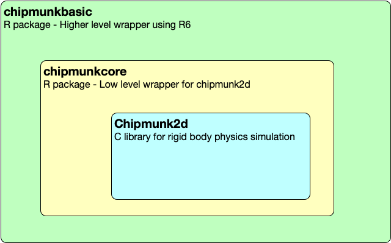

<!-- README.md is generated from README.Rmd. Please edit that file -->

# chipmunkcore

<!-- badges: start -->

 [](https://www.tidyverse.org/lifecycle/#experimental)
<!-- badges: end -->

`chipmunkcore` is a low-level wrapper around the
[Chipmunk2d](http://chipmunk-physics.net/) rigid body physics simulation
library.

`chipmunkcore` is just the simulator. To actually render the positions
of bodies in the simulation you’ll need to use
[ggplot2](https://cran.r-project.org/package=ggplot2),
[cairocore](https://github.com/coolbutuseless/cairocore) or something
else

**Read the online documentation for `chipmunkcore`
[here](https://coolbutuseless.github.io/package/chipmunkcore)**

**Regular users will probably want to use the higher level wrapper
[`chipmunkbasic`](https://coolbutuseless.github.io/package/chipmunkbasic)**

## Chipmunk2d

  - [Chipmunk2d](http://chipmunk-physics.net/) is a C library for
    simulating rigid body physics
  - [chipmunkcore](https://coolbutuseless.github.io/package/chipmunkcore)
    is a very low-level wrapper around the C library, providing 1-to-1
    mapping between R functions and the core C library
  - [chipmunkbasic](https://coolbutuseless.github.io/package/chipmunkbasic)
    provides a nicer wrapper around `chipmunkcore`



## Pre-requisites - macOS

You’ll need to install the [Chipmunk2d](http://chipmunk-physics.net/)
library on your system.

I only know how to do this on macOS where you can do

    brew install chipmunk

You may also need to update/install your xcode tools - see
[here](https://stackoverflow.com/questions/58313047/cannot-compile-r-packages-with-c-code-after-updating-to-macos-catalina)

## Pre-requisites - windows + linux

If you know how to install the [Chipmunk2d C
library](http://chipmunk-physics.net/) on other systems, and
subsequently compile this package, please let me know by filing an
issue, or pinging me on [twitter](https://twitter.com/coolbutuseless)

## Installation

After installing the [Chipmunk2d](http://chipmunk-physics.net/) C
library, you can install this package from
[GitHub](https://github.com/coolbutuseless/chipmunkcore) with:

``` r
# install.package('remotes')
remotes::install_github('coolbutuseless/chipmunkcore')
```

## Vignettes

  - [Advanced - lower level
    functions](https://coolbutuseless.github.io/package/chipmunkcore/articles/advanced.html)

## ToDo

  - Add *constraints*
  - Expose more of the underlying C library

## Galton Board

For full code, see the
[vignette](https://coolbutuseless.github.io/package/chipmunkcore/articles/galton.html)
in [chipmunkbasic](https://github.com/coolbutuseless/chipmunkbasic)


## Acknowledgements

  - R Core for developing and maintaining the language.
  - CRAN maintainers, for patiently shepherding packages onto CRAN and
    maintaining the repository
